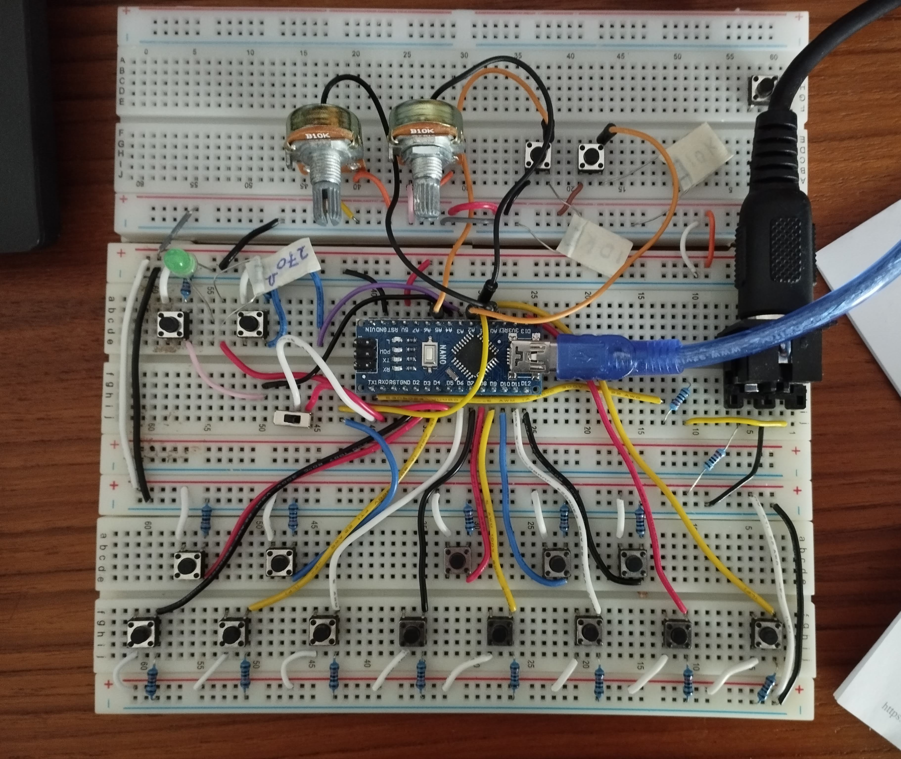
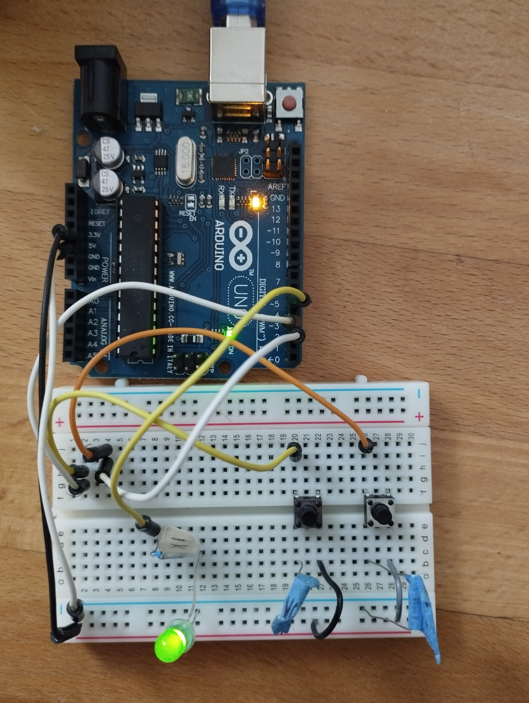
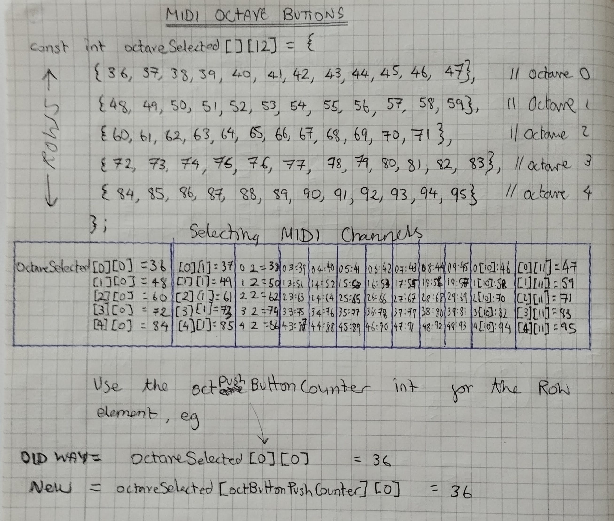

"# midiNoteOn" 

Arp Version (still rough)

MIDI note on

/*  Helios MK2 MIDI button Keyboard
 *  08/05/2022
 *  V1.0 Basic Keyboard working
 *
 *  To DO:
 *  Add - Octave Buttons
 *  Add - Arp
 *  Optimise code
 * 
    Remember: Analog pins as digital - you can't use A6 0r A7

    Much of the inspiration of this code comes from this article;
    https://create.arduino.cc/projecthub/gleberruyer/midi-wood-keyboard-88053e

    Button setup from this article:
    https://www.arduino.cc/en/Tutorial/BuiltInExamples/Button

    Ascii text from: http://patorjk.com/ using 'Ogre' font
*/

____________________________________________________________________________

Octave Buttons:
Up and Down button to choose octaves.  x1 LED status indicator (changes brightness)
LED use 1k resistor
Push Buttons use 10k
- To Do:  Add to MIDI Keyboard code / refactor / Speed up etc

______________________________________________________________________________

